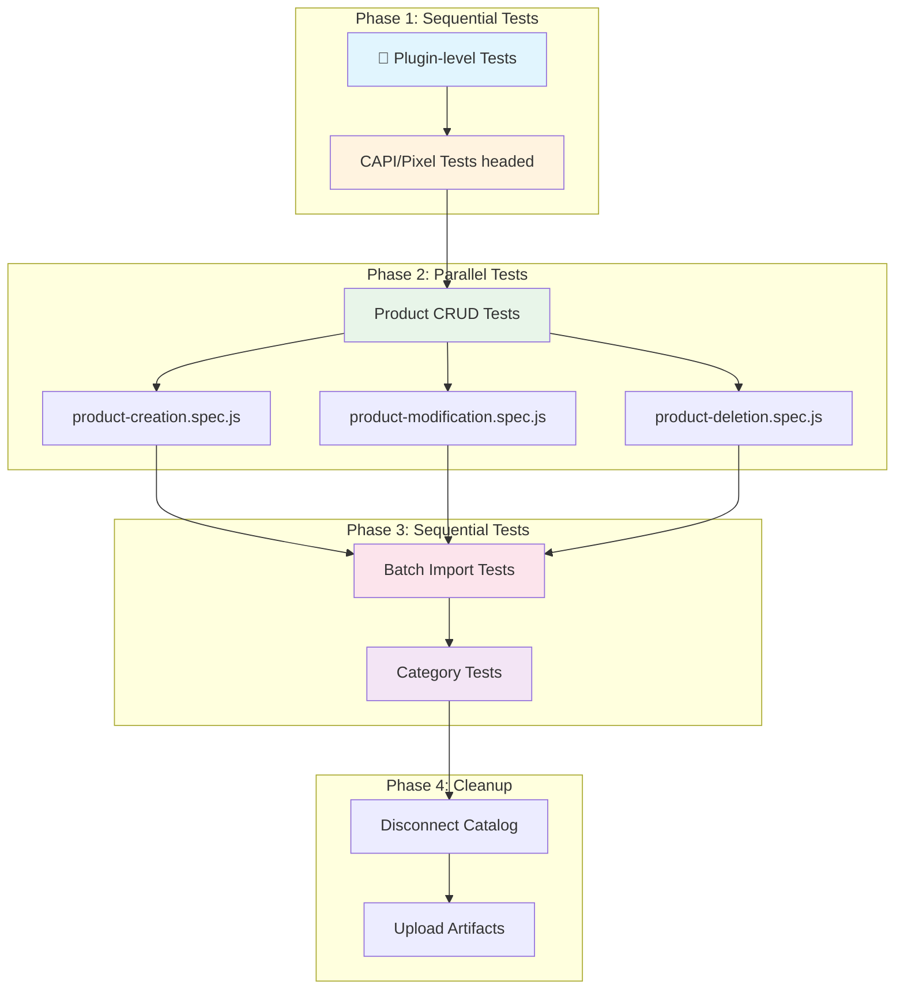
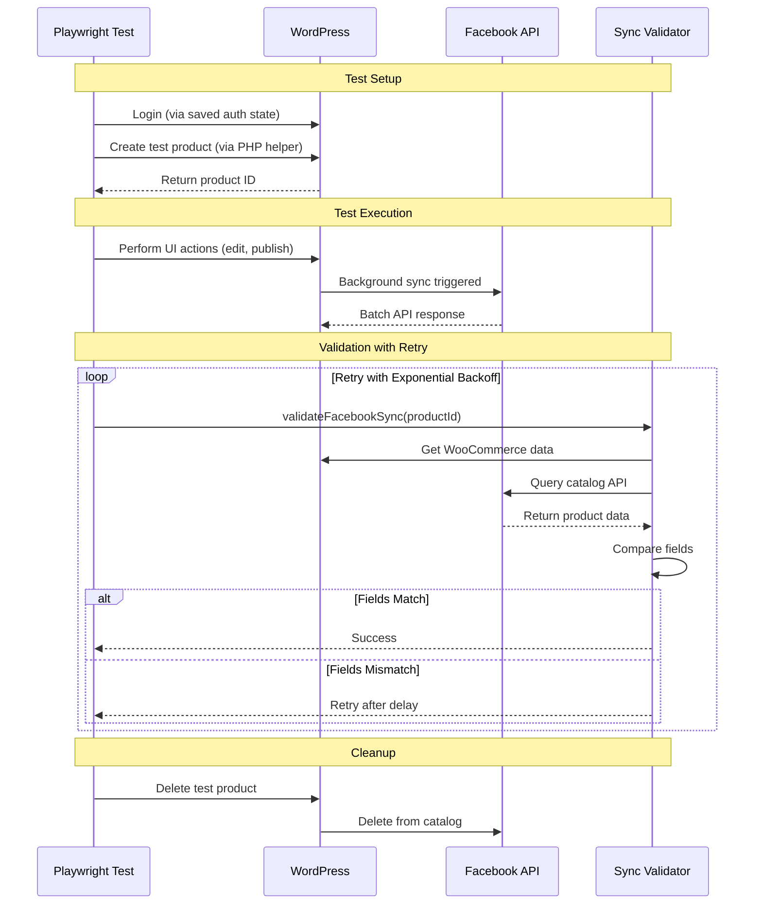

# Facebook for WooCommerce - E2E Test Suite Design Document

## Table of Contents
1. [Introduction](#introduction)
2. [Test Suite Scope](#test-suite-scope)
3. [Lifecycle of a test](#test-lifecycle)
4. [GitHub Actions Workflow Steps](#github-actions-workflow-steps)
5. [Challenges and Solutions](#challenges-and-solutions)

---

## Introduction

This document provides a high-level overview of the End-to-End (E2E) testing infrastructure for the Facebook for WooCommerce plugin. The test suite validates the integration between WooCommerce and Meta's Commerce platform, ensuring that products, categories, and events sync correctly between the WordPress store and Meta's catalog.

## Test Suite Scope
GSD Project: [WooCommerce - Catalog API - E2E Integration Tests](https://fburl.com/gsd/2sk9ne2o)

Tests are organized into groups based on their execution requirements. Some tests can run in parallel while others require sequential execution due to shared state or resource dependencies.

The E2E test suite covers the following functional areas:

| Spec File | Description | Test Count |
|-----------|-------------|------------|
| `plugin-level-tests.spec.js` | Plugin health, connection, compatibility, checkout flow | 17 tests |
| `product-creation.spec.js` | Simple, Variable, and Composite product creation | 3 tests |
| `product-modification.spec.js` | Product editing, Quick Edit, Facebook-specific options | 6 tests |
| `product-deletion.spec.js` | Product deletion, sync exclusion, bulk exclusion | 3 tests |
| `product-category.spec.js` | Category sync as product sets, update, deletion | 3 tests |
| `product-batch.spec.js` | CSV import, batch API validation, bulk updates | 3 tests |
| `events-test.spec.js` | CAPI/Pixel event tracking (PageView, ViewContent, etc.) | 7+ tests |


### Parallel Tests

The following test files contain tests that are **independent** and can run in parallel:

| Test File | Rationale |
|-----------|-----------|
| `product-creation.spec.js` | Each test creates a unique product with unique SKU, no shared state |
| `product-modification.spec.js` | Each test creates its own test product before modification |
| `product-deletion.spec.js` | Each test creates its own products for deletion |

### Sequential Tests

The following tests **must run sequentially** (workers=1):

| Test File | Reason for Sequential Execution |
|-----------|--------------------------------|
| `plugin-level-tests.spec.js` | Tests modify global plugin settings, connection state, and debug mode. Includes disconnect/reconnect tests that affect all subsequent tests. |
| `product-batch.spec.js` | Large batch imports (50+ products) stress the system and require monitoring batch API calls. Background sync jobs compete for resources. |
| `product-category.spec.js` | Categories are synced as Product Sets in Meta Catalog using a retailer id that is not globally unique. Which means categories created parallely could end up having the same retailer id resulting in a collision  |
| `events-test.spec.js` | CAPI/Pixel tests require headed browser mode with Xvfb. Cookie-based event capture has timing dependencies. |

### Test Execution Order

The workflow executes tests in a specific order to ensure proper setup and validation:

```
1. Plugin-level tests     → Validate environment, connection, debug mode
2. CAPI/Pixel tests       → Test event tracking (uses customer session)
3. Product CRUD tests     → Create/Modify/Delete tests (parallel, workers=2)
4. Batch import tests     → CSV imports, batch API validation
5. Category tests         → Product set sync validation
```

### Test Execution Flow Diagram



## Test Lifecycle



---

## GitHub Actions Workflow Steps

The workflow (`product-creation-tests.yml`) orchestrates the complete E2E test environment. Below is a high-level overview of each phase:

### Workflow Overview Diagram

```mermaid
flowchart LR
    subgraph "Phase 1"
        A1[Checkout] --> A2[Node.js]
        A2 --> A3[PHP 8.1]
        A3 --> A4[Hostname]
    end

    subgraph "Phase 2"
        A4 --> B1[Download WP]
        B1 --> B2[Configure wp-config]
        B2 --> B3[Start PHP Server]
        B3 --> B4[Install WP-CLI]
        B4 --> B5[Install WordPress]
    end

    subgraph "Phase 3"
        B5 --> C1[WooCommerce]
        C1 --> C2[Store Config]
        C2 --> C3[Payment Gateway]
        C3 --> C4[Customer User]
        C4 --> C5[Companion Plugins]
    end

    subgraph "Phase 4"
        C5 --> D1[Select MBE Assets]
        D1 --> D2[Install FB WooC Plugin]
        D2 --> D3[Configure Connection]
        D3 --> D4[Rollout Switches]
        D4 --> D5[Verify Connection]
    end

    subgraph "Phase 5"
        D5 --> E1[Install Playwright]
        E1 --> E2[Run Tests]
        E2 --> E3[E2E Test Framework Helpers]
        E3 --> E4[Catalog API]
        E3 --> E5[WooCommerce API]
    end

    subgraph "Phase 6"
        E2 --> F1[Disconnect]
        F1 --> F2[Check Errors]
        F2 --> F3[Upload Artifacts]
    end

    style A1 fill:#e3f2fd
    style B1 fill:#e8f5e9
    style C1 fill:#fff3e0
    style D1 fill:#fce4ec
    style E1 fill:#f3e5f5
    style F1 fill:#efebe9
```



### Phase 1: Environment Setup

| Step | Description |
|------|-------------|
| **Checkout code** | Clone the repository using `actions/checkout@v4` |
| **Setup Node.js** | Configure Node.js using `package.json` version |
| **Setup PHP** | Install PHP 8.1 with required extensions (mysqli, zip, gd, curl, dom, mbstring) |
| **Configure hostname** | Add custom hostname to `/etc/hosts` for test site |

### Phase 2: WordPress Installation

| Step | Description |
|------|-------------|
| **Create WordPress environment** | Download latest WordPress, configure `wp-config.php` with debug settings |
| **Setup logging** | Create debug.log and WooCommerce logs directory |
| **Start PHP server** | Launch built-in PHP server on port 8080 |
| **Install WP-CLI** | Download and configure WP-CLI v2.10.0 |
| **Install WordPress** | Execute `wp core install` with test site configuration |

### Phase 3: WooCommerce Configuration

| Step | Description |
|------|-------------|
| **Install WooCommerce** | Activate WooCommerce, install Storefront theme |
| **Configure store** | Set store address, currency (USD), country (US:CA) |
| **Enable payment** | Configure Cash on Delivery payment gateway |
| **Create customer user** | Create non-admin customer with billing/shipping address |
| **Install companion plugins** | Install WPC Composite Products for composite product tests |

### Phase 4: Facebook Plugin Setup

| Step | Description |
|------|-------------|
| **Select Meta Business Assets** | Rotate through pre-configured MBE asset sets using `github.run_number % ARRAY_LENGTH` |
| **Install Facebook plugin** | Copy from workspace or install from marketplace |
| **Configure connection** | Set access token, pixel ID, catalog ID, business manager ID via `wp option update` |
| **Initialize rollout switches** | Enable CAPI event logging for E2E tests |
| **Verify connection** | Confirm plugin is connected and all settings are present |

### Phase 5: Test Execution

| Step | Description |
|------|-------------|
| **Install Playwright** | Run `npm install` and install Chromium browser |
| **Setup captured-events directory** | Create directory for Pixel event capture |
| **Create test product** | Create "TestP" product for CAPI/Pixel tests |
| **Install Xvfb** | Install virtual framebuffer for headed browser tests |
| **Run Plugin-level tests** | Sequential execution (workers=1) |
| **Run CAPI Pixel tests** | Headed mode with Xvfb (workers=1) |
| **Cleanup test product** | Delete the test product |
| **Run Product CRUD tests** | Parallel execution (workers=2) |
| **Run Batch tests** | Sequential execution (workers=1) |
| **Run Category tests** | Sequential execution (workers=1) |

### Phase 6: Cleanup and Reporting

| Step | Description |
|------|-------------|
| **Disconnect from catalog** | Clean up Facebook connection |
| **Check for PHP errors** | Scan debug.log for fatal errors |
| **Upload artifacts** | Save Playwright report, captured events, PHP logs, WC logs |
| **Upload test videos/screenshots** | Save failure artifacts for debugging |

---

## Challenges and Solutions

### 1. Facebook Catalog Sync Delay

**Problem**: After creating/updating a product in WooCommerce, there's a variable delay before the product appears or updates in the Meta catalog. This caused flaky tests with random failures.

**Solution**: Implemented retry with exponential backoff in the sync validator.

**Reference**: [D87337866](https://www.internalfb.com/diff/D87337866)

**Implementation Details**:
- The `validateFacebookSync()` helper accepts `waitSeconds` and `maxRetries` parameters
- Each retry waits progressively longer: `waitSeconds * (attempt + 1)`
- Default: 10 seconds initial wait, 6 max retries (up to 70 seconds total)
- Validator compares WooCommerce product fields with Facebook catalog data

```javascript
// Example: Allow up to 30 seconds wait, 8 retries for variable products
const result = await validateFacebookSync(productId, productName, 30, 8);
```

---

### 2. Usage of Hard-coded Timeouts in Playwright

**Problem**: Tests used arbitrary `waitForTimeout()` calls that were either too short (causing failures) or too long (wasting CI time). Different WordPress installations have varying response times.

**Solution**: Avoid hardcoded timeouts as much as possible, wait on specific conditions/signals instead.

**Reference**: [D87854546](https://www.internalfb.com/diff/D87854546)

**Implementation**:
Instead of:
```js
await someButton.click();
await page.waitForTimeout(2000);
if (await someElementThatShouldAppearAfterTheClick.isVisible({ timeout: 2000 })) {
  // do something
}
```
We should do:
```js
await someButton.click();
await someElementThatShouldAppearAfterTheClick.waitFor({ state: 'visible', timeout: 2000 });
// proceed with confidence + no redundant 2-second wait
```
Similarly, rely on `waitForSelector()`, `waitForLoadState()`, `waitForUrl()` etc instead of hardcoded timeouts.

---

### 3. WordPress Repeated Login (Reauth Issue)

**Problem**: Each test was performing a fresh login, adding ~5-10 seconds per test. Worse, WordPress sometimes required re-authentication mid-test, causing unexpected failures.

**Solution**: Utilize Playwright global setup to perform login once as both admin and customer, then save browser state for reuse.

**Implementation**:

```javascript
// global-setup.js
async function globalSetup() {
  // Login as ADMIN and save state
  await loginAndSaveAuth(browser, {
    username: adminUsername,
    password: adminPassword,
    authPath: './tests/e2e/.auth/admin.json',
    userType: 'ADMIN',
    loginUrl: `${baseURL}/wp-admin/`,
    // ...
  });

  // Login as CUSTOMER and save state
  await loginAndSaveAuth(browser, {
    username: customerUsername,
    password: customerPassword,
    authPath: './tests/e2e/.auth/customer.json',
    userType: 'CUSTOMER',
    // ...
  });
}
```

```javascript
// playwright.config.js
projects: [
  {
    name: 'chromium-wp-admin',
    use: {
      storageState: './tests/e2e/.auth/admin.json'
    },
  },
  {
    name: 'chromium-wp-customer',
    use: {
      storageState: './tests/e2e/.auth/customer.json'
    },
  }
],
```

**Benefits**:
- Single login per user type per test run
- Tests start with authenticated session instantly
- No mid-test re-authentication failures
- Faster test execution

---

### 4. Shared Catalog/MBE Asset Collisions on Parallel PR Runs

**Problem**: When multiple PRs run E2E tests concurrently, they all share the same Facebook catalog and MBE assets. This caused test pollution where:
- Products created by PR #1 appeared in PR #2's validation
- Deletion tests in one PR affected sync validation in another
- Random test failures that couldn't be reproduced locally

**Breakdown Document**: [Breakdown and Solutions explored](https://docs.google.com/document/d/124XYkhrPqV6Irf5ggItPHK41J7WzEH2xNp7r0OsNIJ4/edit?tab=t.hcgqh93cda4n)

**Solution**: Rotate through multiple pre-onboarded MBE asset sets based on the GitHub run number.

**Reference**: [D89368482](https://www.internalfb.com/diff/D89368482)

**Implementation**:

```yaml
# GitHub Actions workflow
- name: Select Meta Business Assets
  run: |
    # Parse the JSON array of business assets
    ASSETS='${{ secrets.FB_TEST_META_BUSINESS_ASSETS }}'

    # Get the array length
    ARRAY_LENGTH=$(echo "$ASSETS" | jq 'length')

    # Use run_number as selector (sequential: 1, 2, 3, ...)
    SELECTOR="${{ github.run_number }}"

    # Calculate index using modulo
    INDEX=$((SELECTOR % ARRAY_LENGTH))

    # Extract the selected asset set
    SELECTED_ASSET=$(echo "$ASSETS" | jq -c ".[$INDEX]")

    # Set environment variables for subsequent steps
    echo "FB_ACCESS_TOKEN=$(echo $SELECTED_ASSET | jq -r '.wc_facebook_access_token')" >> $GITHUB_ENV
    echo "FB_PRODUCT_CATALOG_ID=$(echo $SELECTED_ASSET | jq -r '.wc_facebook_product_catalog_id')" >> $GITHUB_ENV
    # ... other assets
```

**Asset Pool Structure**:
```json
[
  {
    "wc_facebook_access_token": "TOKEN_1",
    "wc_facebook_product_catalog_id": "CATALOG_1",
    "wc_facebook_pixel_id": "PIXEL_1",
    // ...
  },
  {
    "wc_facebook_access_token": "TOKEN_2",
    "wc_facebook_product_catalog_id": "CATALOG_2",
    "wc_facebook_pixel_id": "PIXEL_2",
    // ...
  },
  // ... more asset sets
]
```

**Benefits**:
- Each concurrent workflow run uses a different MBE asset set
- Deterministic selection based on run number
- Scalable: just add more asset sets to the pool
- No test pollution between PRs

---

### 5. Intercepting and Validating Batch API Calls

**Problem**: Product batch imports trigger background sync jobs that send products to Meta's catalog in batches. Tests needed to:
1. Verify the correct number of batch API calls were made
2. Validate batch sizes (≤100 per Meta's limit)
3. Confirm all API responses returned 200 OK
4. Ensure no products were lost or duplicated

**Solution**: Created a WordPress plugin (`fb-e2e-batch-monitor.php`) that hooks into the Facebook plugin's batch API calls, logs them, and provides WP-CLI commands for test access.

**Reference**: [D88786516](https://www.internalfb.com/diff/D88786516)

**Benefits**:
- Non-intrusive monitoring (plugin is only installed during test)
- Complete visibility into batch API behavior
- Automatic cleanup after test completion
- Filters by product type to avoid false positives from other syncs

---
